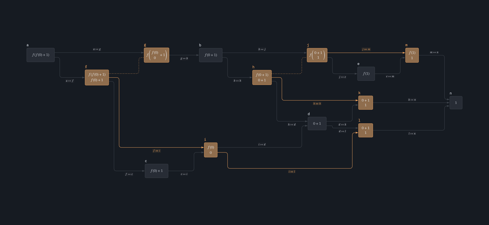

# Graphplot
Graphplot is an efficient tool for visualizing large-scale graphs and diagrams. It generates high-quality SVG plots (and PNG/PDF), supporting advanced layouts and mathematical notation via [Typst](https://typst.app).

## Features
- **Scalable:** Efficient handling of large datasets.
- **Typst integration:** Native support for [Typst](https://typst.app) in nodes and edges.
- **Multiple layouts:** Includes multiple layouts as Layered, Circular, Radial, Forcebased, Spring and Diagram.
- **Multigraph support:** Natively support [multigraphs](https://en.wikipedia.org/wiki/multigraph) allowing for multiple relationships between the same set of nodes.
- **Theming:** built-in support for light and dark themes, and customized config for different use cases.

## Examples





--- 
## Releases
### 0.6.1 (2026-04-25)
- Supports diagrams (with Elk layout engine).

### 0.5.0 (2026-04-02)
- Added support for both PDF and PNG export (with `feature=pdf` and `feature=png`).
- Added config suitable for print: `Options::print()`.
- Added support for `background-opacity` on main plot.


--- 
## License
### IBM Plex
```
Copyright © 2017 IBM Corp. with Reserved Font Name "Plex"
This Font Software is licensed under the SIL Open Font License, Version 1.1 . This license is copied below, and is also available with a FAQ at: https://openfontlicense.org

SIL OPEN FONT LICENSE Version 1.1 - 26 February 2007
```
