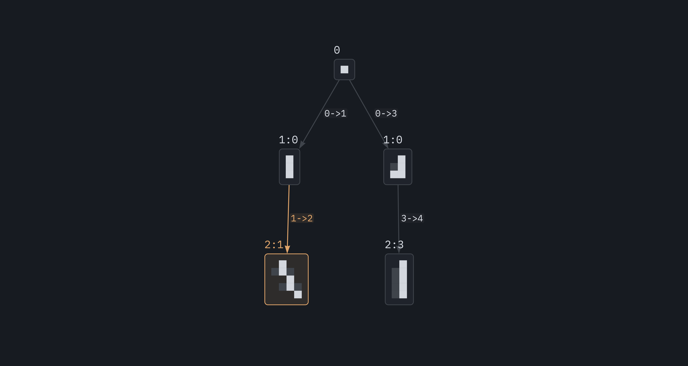
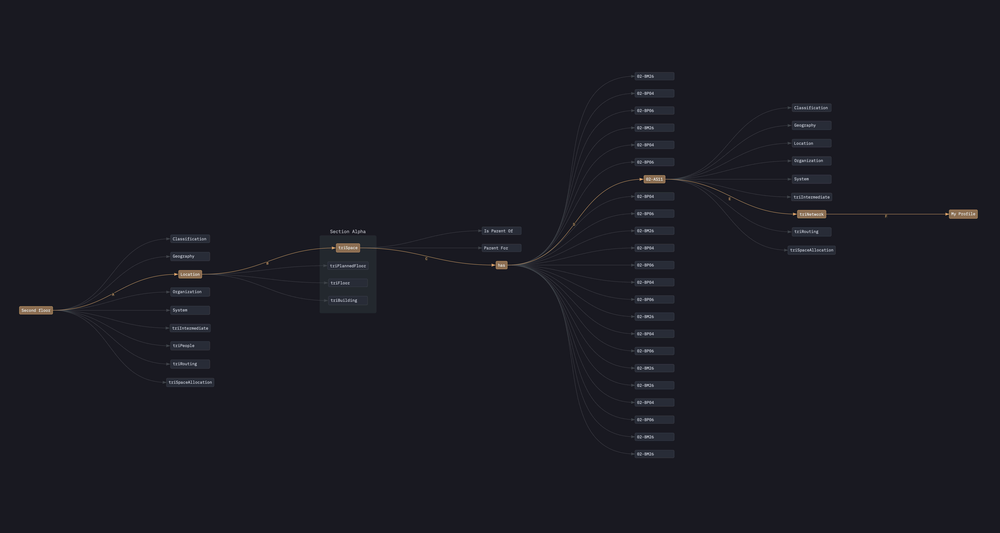

# Graphplot
Graphplot is an efficient tool for visualizing large-scale graphs. It generates high-quality SVG plots, supporting advanced layouts and mathematical notation via [Typst](https://typst.app).

## Features
- **Scalable:** Efficient handling of large datasets.
- **Typst integration:** Native support for [Typst](https://typst.app) in nodes and edges.
- **Multiple layouts:** Includes multiple layouts as Layered, Circular, Radial, Forcebased, Spring and Structured.
- **Multigraph support:** Natively support [multigraphs](https://en.wikipedia.org/wiki/multigraph) allowing for multiple relationships between the same set of nodes.
- **Theming:** built-in support for light and dark themes, and customized config for different use cases.

## Examples

